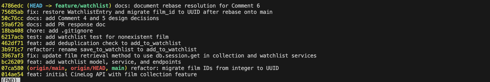

# PR Response Doc — CineLog Watchlist Feature

## AI Usage
I used AI (Claude) as an assistant throughout this project in several specific ways:

1. **Codebase orientation.** Before reading the review comments, I had AI summarize `models.py`, `services/collection_service.py`, and `tests/test_collection.py`, and map how the watchlist code compared to the collection code. I verified each summary against the actual source rather than taking it at face value.

2. **Verifying the deduplication logic (Comment 2).** I wrote the dedup check myself. I then used AI to help run a quick check that added the same film twice and confirmed the second call raised `AlreadyInWatchlistError` with only one row remaining in the database — AI was used to verify behavior, not to write the logic.

3. **Debugging the rebase (Comment 6).** After my rebase reported "success," AI helped me discover it had silently deleted the `WatchlistEntry` model (the test suite failed with an `ImportError`). It explained why git didn't flag a textual conflict, and helped me recover the pre-rebase state from the reflog and re-add the model with a UUID `film_id`.

4. **Commit history and git guidance.** I used AI to check my commit messages against conventional-commit format, to identify which commit needed rewording, and to walk through the interactive rebase step by step.

5. **Drafting and stress-testing the design arguments (Comments 4 and 5).** I formed my own positions first: keep `public=True` because CineLog is a community app, and agree with the maintainer's date-added preference for sort order. I then used AI to sharpen the writing and surface angles I hadn't fully articulated:
   - For **Comment 4**, my core argument was the community-app case for public-by-default. AI helped me name the tradeoff explicitly — the "privacy surprise" of public-by-default and the privacy-by-default counter-principle — and the mitigation (the per-entry `public` flag). My final response builds on that by taking a clear position *and* acknowledging the opposing option, rather than only arguing one side.
   - For **Comment 5**, my position (date-added helps users find recent additions) was my own. AI surfaced the additional point that date-added would make the watchlist consistent with `get_collection()`, which strengthened my engagement with the maintainer's reasoning. I decided to keep the code alphabetical and document date-added as a recommended follow-up.

Some of the prose in my Comment 4 and 5 entries and my PR description was AI-drafted and then reviewed and adjusted by me. The positions, decisions, and final judgments are my own.

## Comment 1 — Rename
**What I did:**
I renamed the function save_to_watchlist() to add_to_watchlist() in the function definition and call sites.
**How I verified:**
Grepped the whole project for the old name and none remain; app imports cleanly; pytest passes 4/4.

## Comment 2 — Deduplication
**What I did:**
I added deduplication to `add_to_watchlist()` in `services/watchlist_service.py`, following the same pattern as `add_to_collection()`. Specifically I (1) defined a new `AlreadyInWatchlistError` exception (mirroring `AlreadyInCollectionError`), and (2) added a check that queries for an existing `WatchlistEntry` with the same `user_id` and `film_id` before inserting — if one exists, it raises `AlreadyInWatchlistError` instead of creating a duplicate row.
**How I verified:**
Note that the existing test suite does NOT cover the duplicate path (the test I wrote for Comment 3 exercises a *nonexistent* film, not a *duplicate* one), so simply running pytest does not verify this logic. I verified it directly instead: added the same film to a user's watchlist twice. The first call succeeded, the second raised `AlreadyInWatchlistError`, and a `WatchlistEntry.query.filter_by(...).count()` confirmed exactly one row existed in the database — no duplicate was created.
## Comment 3 — Missing test
**What I did:**
I created a new file tests/test_watchlist.py. Writing the equivalent test of test_add_to_collection_nonexistent_film_raises but now as test_add_to_watchlist_nonexistent_film_raises following the same fixture and assertion structure.
**How I verified:**
I ran the new pytest as well as the whole pytest suite to verify it worked.
## Comment 4 — Default visibility
**My position:**
The default should remain public=True
**Reasoning:**
CineLog is described as "a community film tracking app", so its value depends on users being able to see each other's activity. I'm optimizing for discovery and social engagement. New users seeing what films others in their community are saving is the whole point of a shared tracking app. Defaults matter here because most users never change them: if watchlists were private by default, the community features would sit empty because almost no one would opt in. Public-by-default is what makes the "community" in the app's own description actually work.
**Tradeoff acknowledged:**
The cost of this choice is a potential privacy surprise: adding a film to a watchlist feels like a private "save for later," and some users won't expect that action to be visible to others. The more conservative option, private by default, avoids that surprise, since users can't accidentally over-share and can opt into visibility when they want it. I'm accepting the public default because the app is explicitly social and the feature loses most of its value if lists are hidden, but it's a real tradeoff. It's mitigated by the fact that the public field still exists per-entry, so a user can mark an entry private, and we can revisit the default if users report feeling exposed.

## Comment 5 — Sort order
**My position:**
Watchlists should default to "date added" order rather than alphabetical.
**Reasoning:**
Users want to see what they have added recently and be able to scroll down and see what they may have added in the past. Having it be chronological solves that problem whereas having them sorted alphabetically makes it harder for users to find movies they've recently added to their watchlist.
**Engagement with reviewer's point:**
I agree with the reviewer's preference for "date added" order, and with their reasoning that most users want to see what they added recently. Beyond the user-experience point they raised, sorting by date added also makes the watchlist consistent with `get_collection()`, which already orders by `date_added` descending. Aligning the two features means the app behaves the same way across collections and watchlists rather than surprising users with different sort orders, and it's easier to maintain. If implemented, this would be a small change to `get_watchlist()`: switching `.order_by(Film.title.asc())` to `.order_by(WatchlistEntry.date_added.desc())` (which also removes the now-unnecessary join to `Film`).

## Comment 6 — Rebase
**What conflicted:**
Interestingly, git reported *no* textual conflict — the rebase completed "successfully" both times I ran it, but it silently deleted my `WatchlistEntry` model. The cause: main's UUID refactor commit had *removed* `WatchlistEntry` from `models.py`, and my branch commits never re-edited those exact lines (my changes were in the service, route, and test files). Git's 3-way merge saw "one side deleted these lines, the other side didn't touch them" and applied the deletion without asking. I only caught it because running the test suite after the rebase failed with `ImportError: cannot import name 'WatchlistEntry'`. The real conflict was semantic, not textual: my watchlist code was written against integer film IDs, while main had migrated `Film.id` (and all foreign keys) to UUID strings.

**How I resolved it:**
I re-added the `WatchlistEntry` model to `models.py`, updated for the UUID schema: `film_id` changed from `db.Integer` to `db.String(36)` with the same `ForeignKey("film.id")`, matching how `CollectionEntry.film_id` was migrated on main. I also updated the docstring in `add_to_watchlist()` that still described `film_id` as an integer ("pre-refactor"). I committed this as its own commit on top of the rebased branch.

**How I verified no conflict remains:**
- `grep` for `Integer`/`pre-refactor` in the watchlist service and routes returns nothing — no integer ID references remain.
- All four models (`User`, `Film`, `CollectionEntry`, `WatchlistEntry`) are present in `models.py`, all with `String(36)` UUID keys.
- The app imports and starts cleanly.
- `pytest tests/` passes 5/5 — including the watchlist tests that had failed with `ImportError` right after the rebase.
- `git log --merges origin/main..HEAD` is empty, confirming a linear history with no merge commits.

## Commit History


## PR Description

### What it does
Adds a watchlist so users can save films they want to watch later — separate
from the collection, which tracks films already watched. Introduces a
`WatchlistEntry` model and two REST endpoints:

- `POST /watchlist/<user_id>/add` — add a film to the user's watchlist.
  Body: `{ "film_id": "<uuid>" }`. Returns `201` with the created entry.
- `GET /watchlist/<user_id>` — return all films on the user's watchlist.

Duplicate adds are rejected (a film can appear on a watchlist only once), and
adding a film that doesn't exist raises a not-found error.

### Design decisions
1. **Default visibility — public (`public=True`).** New watchlist entries are
   public by default. CineLog is described as a community film-tracking app, so
   I optimized for discovery and social engagement: private-by-default would
   leave the community features empty since most users never change defaults.
   Tradeoff: public-by-default risks a privacy surprise for users who expect
   "save for later" to be private. Mitigated by the per-entry `public` flag, so
   users can still make an entry private, and the default can be revisited.

2. **Sort order — alphabetical, with date-added documented as a follow-up.**
   `get_watchlist()` currently returns entries alphabetically by title. I agree
   with the maintainer's preference for date-added (newest first) — most users
   want to see what they recently added, and it would make the watchlist
   consistent with `get_collection()`, which already orders by date added. I've
   documented date-added as a recommended follow-up: a one-line change in
   `get_watchlist()` from `.order_by(Film.title.asc())` to
   `.order_by(WatchlistEntry.date_added.desc())`.

### How to manually test
1. Install deps and start the app:
   ```
   pip install -r requirements.txt
   python app.py            # runs on http://localhost:5000
   ```
2. Seed a user and a film, and capture their UUIDs (the DB starts empty):
   ```
   python -c "
   from app import create_app, db
   from models import User, Film
   app = create_app()
   with app.app_context():
       u = User(username='alice', email='alice@example.com')
       f = Film(title='Dune', year=2021, genre='Sci-Fi')
       db.session.add_all([u, f]); db.session.commit()
       print('USER_ID:', u.id); print('FILM_ID:', f.id)
   "
   ```
3. Add the film to the watchlist (expect `201`):
   ```
   curl -X POST http://localhost:5000/watchlist/<USER_ID>/add \
     -H "Content-Type: application/json" -d '{"film_id": "<FILM_ID>"}'
   ```
4. View the watchlist (expect the film in the list):
   ```
   curl http://localhost:5000/watchlist/<USER_ID>
   ```
5. Add the same film again — no duplicate entry is created (the service raises
   `AlreadyInWatchlistError`; the watchlist stays at one entry).
6. Run the test suite:
   ```
   pytest tests/
   ```